# Yad ElAwn - Full System Workflow

هذا الملف يشرح دورة العمل الكاملة للنظام من أول لحظة يدخل فيها المستخدم لحد ما البيانات تتحفظ وتظهر في الواجهة.

## 1) الصورة الكبيرة للنظام

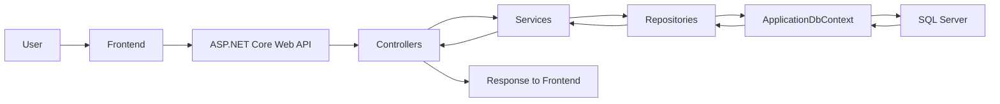

### الفكرة العامة
- المستخدم يتعامل مع الواجهة الأمامية.
- الواجهة تبعت request للـ API.
- الـ Controller يستقبل الطلب.
- الـ Service ينفذ منطق الشغل.
- الـ Repository يتعامل مع قاعدة البيانات.
- الـ DbContext يترجم الكود إلى أوامر SQL.
- SQL Server يحفظ أو يقرأ البيانات.
- النتيجة ترجع في response للفرونت.

---

## 2) دورة المستخدم من البداية للنهاية

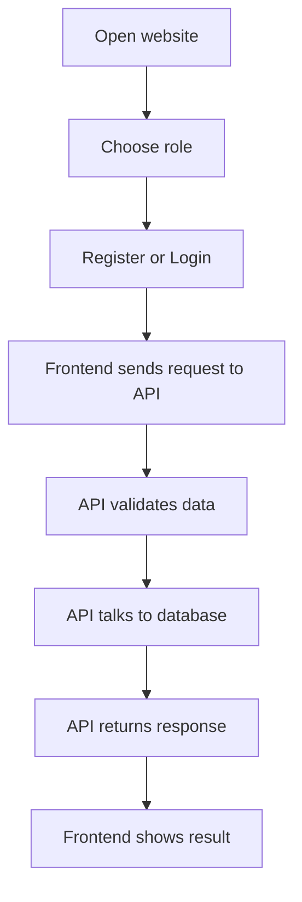

### ماذا يحدث فعليًا؟
1. المستخدم يدخل على الموقع.
2. يحدد دوره:
   - Donor
   - Charity
   - Beneficiary
   - Admin
3. إذا لم يكن مسجّلًا، يذهب إلى التسجيل.
4. إذا كان مسجّلًا، يذهب إلى تسجيل الدخول.
5. بعد النجاح، يحصل على صلاحيات الاستخدام المناسبة.
6. يبدأ في تنفيذ العمليات حسب نوعه.

---

## 3) Registration Flow

### ملف البداية
- `backend/api/YadElAwn.Api/Controllers/RegistrationsController.cs`

### الفكرة
كل نوع مستخدم له endpoint مستقل:
- `/api/registrations/donor`
- `/api/registrations/charity`
- `/api/registrations/beneficiary`
- `/api/registrations/admin`

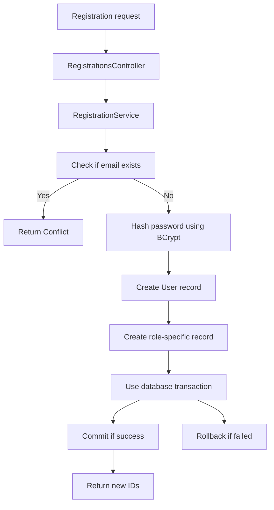

### تفصيل المهم
#### أ) التحقق من الإيميل
- النظام يتأكد أن الإيميل غير مستخدم.
- لو موجود، يرجع `Conflict`.

#### ب) تشفير كلمة السر
- الباسورد لا يتخزن نصًا صريحًا.
- يتم تشفيره بـ BCrypt.

#### ج) إنشاء سجل المستخدم
- يتم حفظ بيانات المستخدم الأساسية في جدول `User`.

#### د) إنشاء سجل النوع
- لو Donor: يتم إنشاء سجل في `Donor`.
- لو Charity: يتم إنشاء سجل في `Charity`.
- لو Beneficiary: يتم إنشاء سجل في `Beneficiary`.
- لو Admin: يتم إنشاء سجل في `Admin`.

#### هـ) Transaction
- لو أي خطوة فشلت، كل العملية ترجع.
- هذا يمنع وجود User بدون Role أو Role بدون User.

---

## 4) Login Flow

### ملف البداية
- `backend/api/YadElAwn.Api/Controllers/AuthController.cs`

### الفكرة
المستخدم يدخل email و password، ثم النظام يتحقق ويولد JWT token.

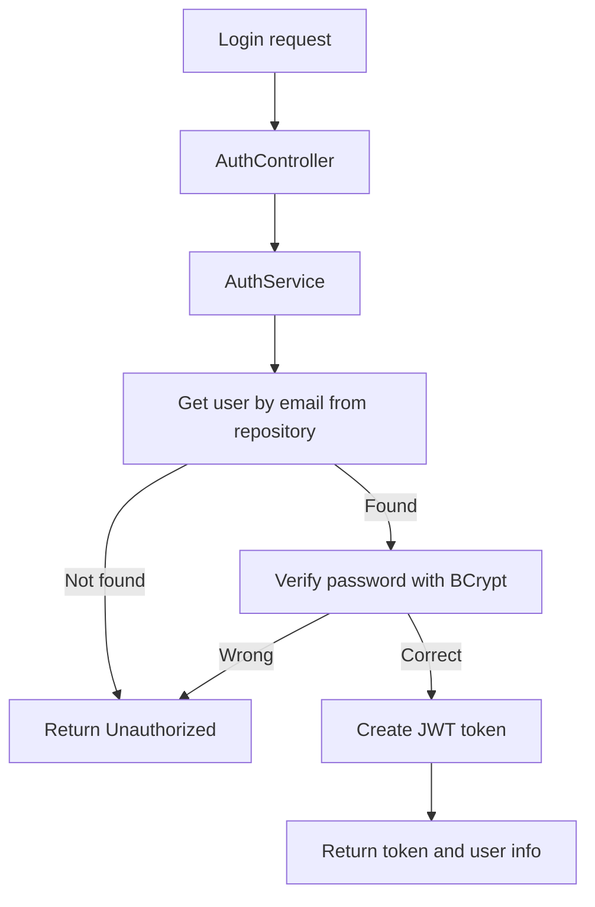

### تفاصيل إضافية
- الـ token يحتوي على:
  - `UserId`
  - `Email`
  - `UserType`
- هذا token يستخدم بعد ذلك في أي request محمي.

### كيف يستخدمه الفرونت؟
```http
Authorization: Bearer <TOKEN>
```

---

## 5) Donation Creation Flow

### ملف البداية
- `backend/api/YadElAwn.Api/Controllers/DonationsController.cs`

### الفكرة
المتبرع يرسل request لإنشاء donation، والنظام يقرر نوع التبرع ويتعامل معه داخل transaction.

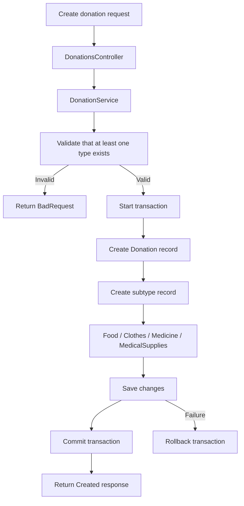

### تفاصيل العملية
#### أ) التحقق
- لازم request يحتوي على واحدة على الأقل من الأنواع:
  - Food
  - Clothes
  - Medicine
  - MedicalSupplies

#### ب) إنشاء السجل الرئيسي
- يتم إنشاء صف جديد في جدول `Donation`.

#### ج) إنشاء التفاصيل الفرعية
- إذا كان النوع Food، يتم إنشاء صف في `Food`.
- إذا Clothes، يتم إنشاء صف في `Clothes`.
- إذا Medicine، يتم إنشاء صف في `Medicine`.
- إذا MedicalSupplies، يتم إنشاء صف في `MedicalSupplies`.

#### د) نجاح العملية
- إذا نجحت كل الخطوات، يرجع النظام donation الجديد.

---

## 6) Donation Status Update Flow

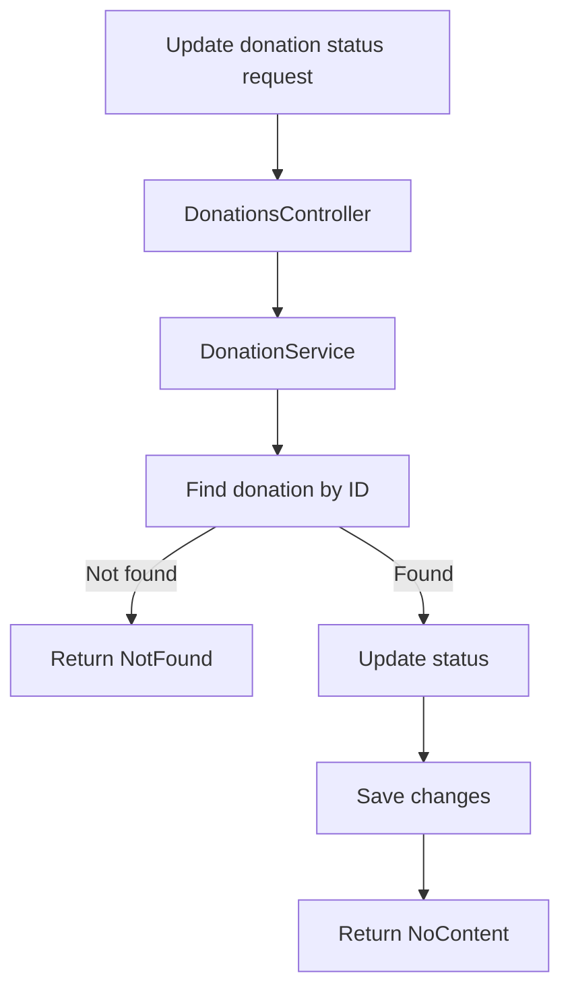

### ماذا يحدث؟
- يتم البحث عن donation بالـ ID.
- لو غير موجود، يتم إرجاع `NotFound`.
- لو موجود، يتم تحديث الحالة.
- أمثلة على الحالة:
  - Pending
  - Available
  - Matched
  - Completed

---

## 7) Messages Flow

### الفكرة
- المستخدم يرسل رسالة لمستخدم آخر.
- الرسالة تحفظ في قاعدة البيانات.
- الطرف الآخر يمكنه رؤيتها في inbox.

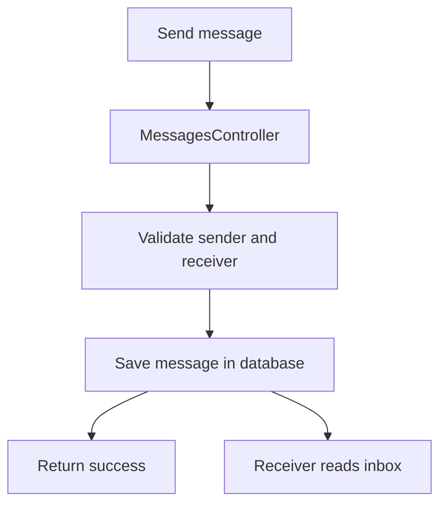

### ما الذي يحدث؟
1. SenderId و ReceiverId و Content تصل في request.
2. يتم حفظ الرسالة.
3. يمكن عرض الرسائل لاحقًا عبر inbox endpoint.

---

## 8) Notifications Flow

### الفكرة
- النظام ينشئ notification عندما يحدث شيء مهم.
- مثل:
  - تبرع جديد
  - مطابقة
  - رسالة
  - تحديث حالة

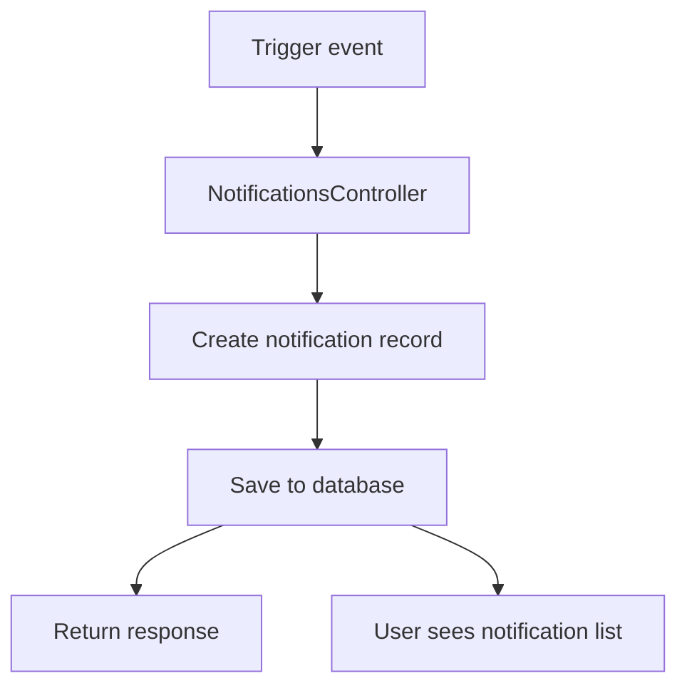

### الهدف
- إبقاء المستخدم على علم بما يحدث داخل النظام.

---

## 9) Matching Flow

### الفكرة
المطابقة تربط donation بجهة مناسبة مثل charity أو beneficiary.

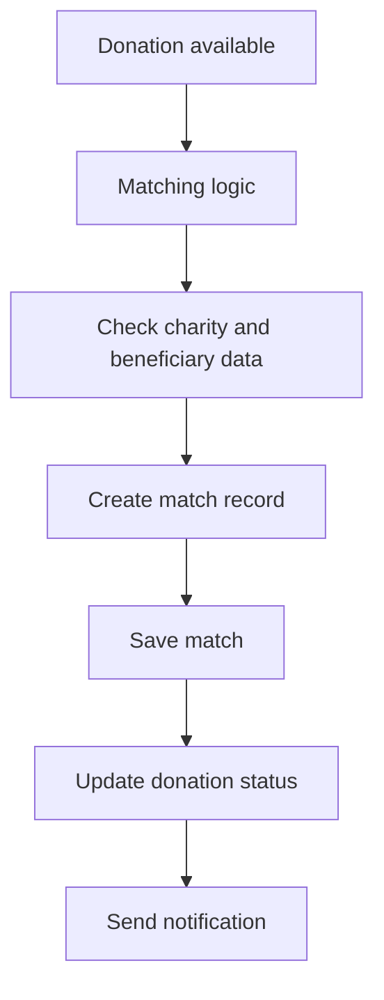

### ماذا يعني هذا؟
- إذا كان هناك donation مناسب، يتم إنشاء match.
- يتم حفظ العلاقة في جدول `Match`.
- غالبًا يتم تحديث حالة donation بناءً على ذلك.
- قد يتم إرسال notification للطرفين.

---

## 10) Data Access Flow

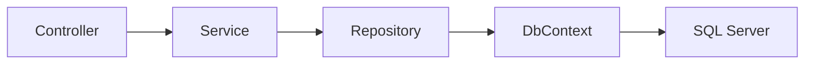

### لماذا هذا التقسيم مهم؟
- `Controller` لا يعرف تفاصيل الداتابيز.
- `Service` لا يكتب queries مباشرة.
- `Repository` هو المسؤول عن التعامل مع البيانات.
- `DbContext` هو طبقة EF Core التي تتعامل مع الجداول.

---

## 11) Error Handling Cycle

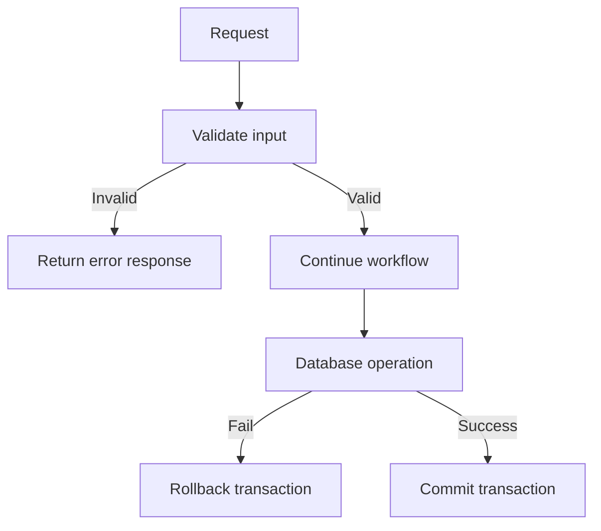

### أمثلة على الأخطاء
- email مكرر
- بيانات ناقصة
- تسجيل دخول خاطئ
- donation بدون تفاصيل
- record غير موجود

### لماذا هذا مهم؟
- يمنع البيانات الفاسدة.
- يحافظ على سلامة النظام.

---

## 12) Swagger Flow

### كيف يشتغل؟
- `Program.cs` يفعل Swagger.
- Swagger يعرض كل endpoints.
- يمكن اختبار الـ API من المتصفح بدون فرونت.

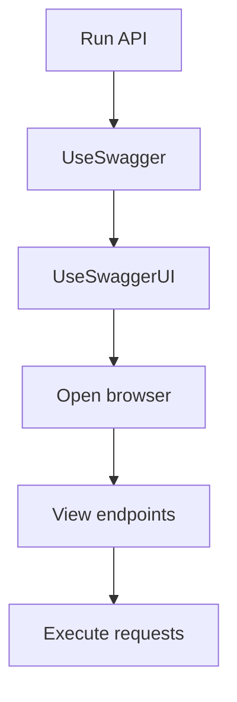

### الرابط
- `http://localhost:5000/`

### ما فائدته؟
- توثيق حي
- تجربة مباشرة
- يسهّل على الفرونت فهم الـ request و response

---

## 13) الملفات التي تشرحينها في المناقشة

- `backend/api/YadElAwn.Api/Program.cs`
- `backend/api/YadElAwn.Api/Data/ApplicationDbContext.cs`
- `backend/api/YadElAwn.Api/Controllers/AuthController.cs`
- `backend/api/YadElAwn.Api/Controllers/RegistrationsController.cs`
- `backend/api/YadElAwn.Api/Controllers/DonationsController.cs`
- `backend/api/YadElAwn.Api/Services/AuthService.cs`
- `backend/api/YadElAwn.Api/Services/RegistrationService.cs`
- `backend/api/YadElAwn.Api/Services/DonationService.cs`
- `backend/api/YadElAwn.Api/Repositories/UserRepository.cs`
- `backend/api/YadElAwn.Api/Repositories/DonationRepository.cs`
- `backend/api/YadElAwn.Api/Dtos/Requests.cs`
- `backend/api/YadElAwn.Api/Models/Entities.cs`

---

## 14) جملة شرح مختصرة جدًا

> النظام يبدأ من `Program.cs`، ثم يمر من الـ Controller إلى Service إلى Repository إلى DbContext ثم SQL Server، وبعدها يرجع الرد للفرونت.  
> التسجيل واللوجين والتبرعات والرسائل والإشعارات والمطابقة كلها ماشية بنفس الدورة، ومعها validation وtransaction وJWT للحماية.

